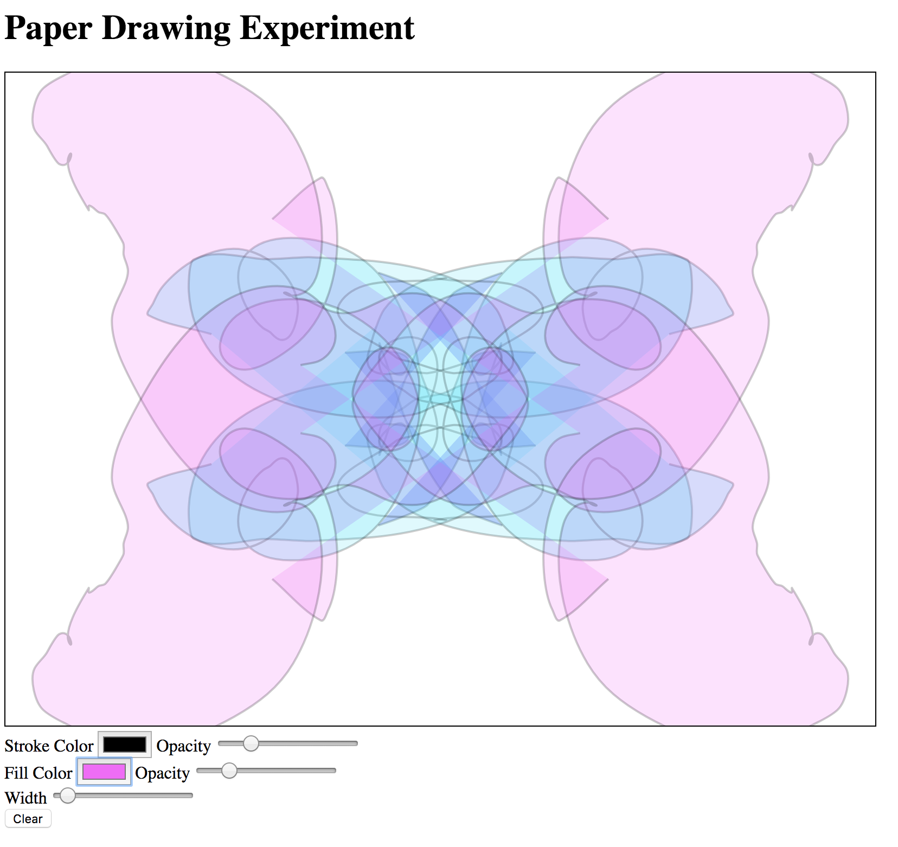

# PaperJS Drawing
## A simple drawing app in the browser
This is just an example of some experimentation that I did with [Paper.js](http://www.paperjs.org).  I haven't done a ton of work on it, the project is open and will likely get more attention when/if I have free time.
Currently it has hard-coded symmetry and path orbiting (like a spirograph) functionality, which I am planning to implement some controls for.

